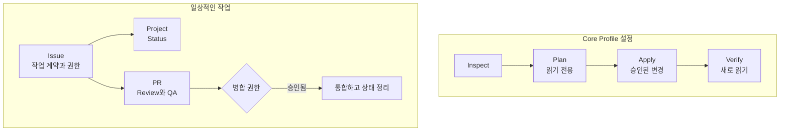

# github-workflow

[](https://github.com/monancho/github-workflow/releases) [](https://github.com/monancho/github-workflow/actions/workflows/platform-smoke.yml?query=branch%3Amain) [](docs/DISTRIBUTION.md) [](LICENSE)

[English](README.md) | **한국어**

사람과 AI 에이전트가 같은 기록을 보고 작업을 이어갈 수 있게 합니다. `github-workflow`는 GitHub에서 쓰는 작업 계약과 v0.1.0 Core Profile을 설정하는 로컬 CLI를 제공합니다.

| 한눈에 보기 | v0.1.0 |
| --- | --- |
| **대상** | 개인 계정의 공개 GitHub.com 저장소를 쓰는 1인 관리자와 소규모 팀 |
| **설정 항목** | Issues, 같은 계정의 전용 User Project, Status 5개, 상황 라벨 2개, 선택한 Issue의 Project 소속 |
| **작업 기록** | GitHub Issue·Project·PR에 남습니다. 설정 후 별도 서비스나 상시 실행 CLI가 필요하지 않습니다. |

이 문서는 한국어 안내입니다. 내용이 다르면 영어 [README](README.md)와 연결된 규범 문서를 따릅니다.

## 시작하기 전에

- **Node.js 22 또는 24**를 사용하세요. 두 버전 모두 Ubuntu 24.04, Windows 2025, macOS 15에서 이식성 검사를 거쳤습니다.
- **개인 계정 소유의 공개 GitHub.com 저장소**와 같은 계정의 전용 User Project를 준비하세요. 검증된 대상은 GitHub Free입니다.
- 작업에 필요한 저장소·User Project 접근 권한이 있는 토큰을 `GH_TOKEN` 또는 `GITHUB_TOKEN` 환경 변수로 설정하세요. Project 읽기에도 인증이 필요합니다. 토큰을 파일에 넣거나 커밋하지 마세요.
- Issue 소속을 설정하려면 기존 추적 대상 Issue와 기록된 승인 근거를 확인하세요. Issue를 만들거나 열어 둔 것만으로 작업 권한이 생기지 않습니다.

**검증된 v0.1.0 범위 밖:** 조직 소유·비공개 저장소, GitHub Enterprise Server, 소유자가 다른 Project, 여러 저장소가 공유하는 Project, 다른 Node.js 메이저 버전. Jira와 Notion은 향후 선택적으로 참고할 수 있지만 이 버전에는 통합·동기화 기능이 없습니다. 자세한 기준은 [요구 사항](https://github.com/monancho/github-workflow/blob/main/docs/REQUIREMENTS.md)을 보세요.

## 설치

[GitHub Releases](https://github.com/monancho/github-workflow/releases)에서 게시 여부를 확인하고, 파일이 올라오면 **`github-workflow-0.1.0.tgz`**를 내려받으세요. 다운로드한 디렉터리에서 실행합니다.

```text
npm install --global ./github-workflow-0.1.0.tgz
github-workflow --version
github-workflow --help
```

패키지는 npm 레지스트리가 아닌 GitHub Release로 배포합니다. GitHub가 자동 생성하는 소스 압축 파일은 설치용 tarball이 아닙니다. 패키지 구성과 소스 빌드 방법은 [배포 안내](docs/DISTRIBUTION.md)에 있습니다.

## 빠른 시작

조정 권한이 있는 기존 Issue 하나를 고르세요. 작업 디렉터리에 `issues.json`을 만들고 `123`을 실제 번호로 바꿉니다.

```json
[{"number":123}]
```

아래 `OWNER`와 `REPO`는 GitHub에 표시된 정확한 소유자 로그인과 저장소 이름으로 바꾸세요. 네 단계에서 같은 `issues.json`을 사용합니다. Plan과 Apply 결과는 JSON으로 저장해야 합니다.

### 1. 현재 상태 검사

GitHub를 바꾸지 않고 관리 대상, 누락, 충돌을 확인합니다.

```text
github-workflow inspect --owner OWNER --repo REPO --profile v0.1.0-core-profile --issues issues.json
```

### 2. 변경 계획 확인

예정된 작업을 저장합니다. 계속하기 전에 `plan.json`을 열어 보세요. `ready`는 변경 예정, `no-change`는 변경 불필요, `blocked`는 문제 해결 후 새 Plan이 필요하다는 뜻입니다.

```text
github-workflow plan --owner OWNER --repo REPO --profile v0.1.0-core-profile --issues issues.json --format json > plan.json
```

### 3. 승인된 계획 적용

**Apply는 GitHub를 변경합니다.** `plan.json`의 작업이 승인된 경우에만 진행하세요. Apply는 실행 직전 현재 관리 상태가 저장된 Plan과 맞는지 확인합니다. 상태가 달라졌다면 다시 검사하고 계획하세요.

```text
github-workflow apply --owner OWNER --repo REPO --profile v0.1.0-core-profile --issues issues.json --plan plan.json --format json > apply.json
```

### 4. 결과 검증

Verify는 Plan·Apply 파일을 확인하고 GitHub를 새로 읽습니다. 결과가 `verified`일 때만 해당 상태가 맞는 것으로 판단하세요. 검증 범위는 `issues.json`의 Issue이며 저장소의 모든 Issue가 아닙니다.

```text
github-workflow verify --owner OWNER --repo REPO --profile v0.1.0-core-profile --issues issues.json --plan plan.json --apply-report apply.json
```

## GitHub에서 작업 이어가기

CLI는 Project를 설정합니다. 실제 작업 기록은 GitHub의 기본 기능에 남깁니다.



Issue에 작업 계약과 승인 근거를 기록합니다. Sub-Issue는 독립적으로 추적할 작업을 나누고, Issue Dependency는 **실제 차단 관계**에만 사용합니다. Project Status는 `Backlog → Ready → In Progress → Review → Done`으로 진행하며 재작업 때 뒤로 돌아갈 수 있습니다. `blocked`와 `needs-decision`은 별도 Status가 아니라 상황 표시입니다.

연결된 PR에 변경 내용과 독립 Review/QA를 남깁니다. 실행·병합·릴리스 권한은 각각 판단합니다. `Done`만으로 완료가 증명되지 않습니다. 성공한 Issue는 근거를 기록하고 `Completed`로 닫으세요. 전체 규칙은 [워크플로 명세](https://github.com/monancho/github-workflow/blob/main/docs/WORKFLOW_SPEC.md)를 따릅니다.

## CLI가 관리하는 범위

CLI는 Issues 사용 가능 상태, 같은 계정의 전용 User Project와 Status 5개, `needs-decision`·`blocked` 라벨을 조정합니다. 선택한 Issue의 Project 소속과 해당 수명 주기 효과도 다룹니다. 호환되는 기존 상태는 재사용하고 무관한 라벨·Project·저장소 설정은 보존합니다. 임의의 Project를 전용 Project로 바꾸거나 기존 라벨의 색상·설명을 기본값으로 덮어쓰지 않습니다.

모든 추적 대상 Issue를 자동으로 찾거나 일상적인 작업을 대신 실행하지는 않습니다. 이미 맞는 상태에서 다시 계획하면 변경 사항이 없습니다.

<details>
<summary>Issue 선택과 출력 형식</summary>

Issue 소속을 검사하지 않고 저장소와 Project만 설정할 때에는 `--issues`를 생략할 수 있습니다. 승인된 초기 Status가 `Backlog`가 아니라면 실제 승인 근거를 기록한 뒤 `{"number":123,"authorizedInitialStatus":{"status":"Ready","authorizationRef":"issue-123-comment"}}` 형식으로 요청하세요.

기본 출력은 JSON입니다. 읽기 편한 결과가 필요하면 `--format text`를 쓰되, 저장할 Plan·Apply 파일은 JSON으로 유지하세요. 결과에는 `schemaVersion: 1`과 `resourceScope: "core-profile"`이 들어갑니다.

</details>

<details>
<summary>실패 복구와 종료 코드</summary>

Plan이 오래되었거나 차단되었다면 현재 상태를 검사하고 새 Plan을 만드세요. 저장된 Plan을 고쳐 검사를 우회하지 마세요. Apply가 중단되거나 일부만 실행되면 변경 결과가 불확실할 수 있습니다. GitHub 상태를 확인하고 새로 계획한 뒤, 승인 범위 안에서 Apply와 Verify를 다시 실행하세요. 변경 요청은 자동 재시도하지 않으며 검증이 끝나지 않았다면 성공이 아닙니다.

CLI는 대화형 입력을 요구하지 않습니다. 구조화된 결과는 stdout으로 출력하고, 단계 결과를 만들기 전 예상 밖의 실패가 나면 stderr에도 일반적인 메시지를 남깁니다. 자격 증명과 원본 GitHub 오류 본문은 결과에 노출하지 않습니다.

| 코드 | 결과 |
| --- | --- |
| `0` | `inspected`, `ready`, `no-change`, `applied`, `verified` |
| `2` | `invalid-input` |
| `3` | `blocked` |
| `4` | `unsupported` |
| `5` | `unverifiable`, `non-conforming` |
| `6` | `partial-failure`, `interrupted` |
| `7` | `failed` 또는 예상 밖의 실패 |

</details>

## 도움말과 참고 문서

민감하지 않은 버그나 사용 질문은 CLI 결과, 재현 단계, 실행 환경을 적어 [공개 Issue](https://github.com/monancho/github-workflow/issues)로 알려 주세요. 변경 제안과 PR은 [CONTRIBUTING.md](https://github.com/monancho/github-workflow/blob/main/CONTRIBUTING.md)를 따릅니다. 취약점으로 의심된다면 공개 Issue·Discussion 대신 [SECURITY.md](SECURITY.md)의 비공개 경로로 제보하세요.

- [워크플로 명세](https://github.com/monancho/github-workflow/blob/main/docs/WORKFLOW_SPEC.md)와 [요구 사항](https://github.com/monancho/github-workflow/blob/main/docs/REQUIREMENTS.md): 동작과 지원 범위
- [배포 안내](docs/DISTRIBUTION.md): 설치, 이식성 검사, 런타임 상세
- [릴리스 안내](https://github.com/monancho/github-workflow/blob/main/docs/RELEASING.md): 관리자의 게시 절차

[MIT 라이선스](LICENSE)를 따릅니다.
