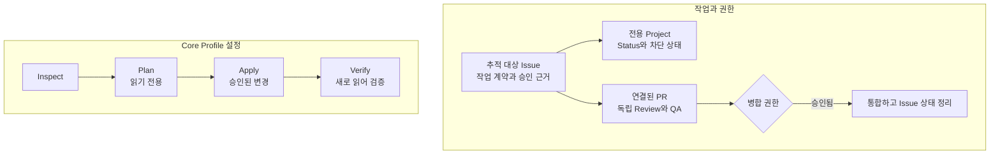

# github-workflow

[](https://github.com/monancho/github-workflow/releases)
[](https://github.com/monancho/github-workflow/actions/workflows/platform-smoke.yml?query=branch%3Amain)
[](docs/DISTRIBUTION.md)
[](LICENSE)

[English](README.md) | **한국어**

**사람과 AI 에이전트가 함께 쓰는 GitHub 중심의 작업 계약과 설정 도구입니다.** Issue, 전용 Project, PR에 작업을 남겨 다른 사람이나 에이전트가 실행 권한, 차단 상태, 검증 결과를 파악할 수 있게 합니다. 로컬 CLI는 v0.1.0 GitHub Core Profile을 설정하고 검사합니다. 설정 후 일상적인 작업에는 호스팅 서비스나 상시 실행 중인 `github-workflow` 프로세스가 필요하지 않습니다.

이 문서는 영어 [README](README.md)의 한국어 안내입니다. 내용이 다르면 영어 README와 연결된 규범 문서가 우선합니다. v0.1.0 설치 패키지는 GitHub Release 첨부 파일로 배포합니다. 게시 여부와 `github-workflow-0.1.0.tgz` 파일은 [Releases](https://github.com/monancho/github-workflow/releases)에서 확인하세요.

## 제공 기능

- **공유 작업 계약:** 추적하는 Issue에는 작업 계약과 기록된 승인 근거를 둡니다. Issue를 만들거나 열어 두는 것만으로 실행 권한이 생기지 않습니다. Sub-Issue는 독립적으로 추적하는 작업을 분해하고, Issue Dependency는 실제 차단 관계를 나타냅니다. 전용 User Project는 `Backlog`, `Ready`, `In Progress`, `Review`, `Done` 상태를 관리하며, 연결된 PR에는 변경 내용, 독립 Review/QA, 통합 근거를 남깁니다.
- **Core Profile 설정:** `inspect`, `plan`, `apply`, `verify`로 저장소의 Issues 사용 가능 상태, 같은 개인 계정 소유의 전용 User Project와 Status 값, `needs-decision`·`blocked` 라벨, 명시적으로 선택한 Issue의 Project 소속 및 수명 주기 효과를 조정합니다.
- **확인 가능한 안전한 변경:** Plan은 상태를 읽고 변경안을 만듭니다. Apply는 저장한 Plan과 현재 관리 상태가 여전히 맞는지 확인한 뒤 변경합니다. Verify는 GitHub를 다시 읽습니다. 호환되는 기존 GitHub 상태를 재사용하고 무관한 설정을 보존하며, 이미 맞는 상태에서 다시 실행하면 변경 계획이 없습니다.

CLI는 설정 도구이며 에이전트 실행기나 상시 동기화 서비스가 아닙니다. 작업을 고르거나, 변경을 승인하거나, PR을 병합하거나, 릴리스 권한을 부여하지 않습니다.

## 작동 방식

작업 계약은 GitHub의 기본 기록에 남습니다. 별도의 CLI 설정 절차는 선택한 Core Profile 상태를 그 계약에 맞게 정리합니다.



## 요구 사항과 설치

검증된 v0.1.0 대상은 **개인 계정이 소유한 공개 GitHub.com 저장소**입니다. GitHub Free 기능과 같은 계정 소유의 전용 User Project를 사용합니다. CLI는 **Node.js 22와 24**에서 검증했으며, 두 버전 모두 Ubuntu 24.04, Windows 2025, macOS 15에서 이식성 검사를 거쳤습니다. 실행할 작업에 필요한 대상 저장소 및 User Project 접근 권한이 있는 GitHub 자격 증명이 필요합니다. CLI 실행 전에 환경 변수 `GH_TOKEN` 또는 `GITHUB_TOKEN`을 설정하세요. 읽기 전용 Project 검사에도 인증이 필요합니다. 토큰을 Issue 선택 파일에 넣거나 커밋하지 마세요.

v0.1.0 Release 첨부 파일이 게시되면 [GitHub Releases](https://github.com/monancho/github-workflow/releases)에서 **`github-workflow-0.1.0.tgz`**를 내려받고, 그 파일이 있는 디렉터리에서 실행하세요.

```text
npm install --global ./github-workflow-0.1.0.tgz
github-workflow --version
github-workflow --help
```

이 패키지는 npm 레지스트리에 게시되지 않았습니다. GitHub가 자동 생성하는 소스 압축 파일은 설치용 npm tarball과 다릅니다. 패키지 구성과 소스 체크아웃 사용법은 [배포 안내](docs/DISTRIBUTION.md)를 보세요.

## 빠른 시작

Project 소속을 조정할 권한이 있는 저장소와 **기존의 추적 대상 Issue**를 고르세요. 작업 디렉터리에 해당 번호를 담은 `issues.json`을 만듭니다. 아래 `123`은 실제 Issue 번호로 바꾸세요.

```json
[{"number":123}]
```

`OWNER`와 `REPO`는 저장소 소유자의 정확한 로그인과 저장소 이름으로 바꾸세요. 네 단계에서 같은 `issues.json`을 사용합니다. 아래 명령은 기본적으로 JSON을 출력하며, 저장할 Plan과 Apply 파일은 JSON 형식을 유지해야 합니다.

```text
github-workflow inspect --owner OWNER --repo REPO --profile v0.1.0-core-profile --issues issues.json
github-workflow plan --owner OWNER --repo REPO --profile v0.1.0-core-profile --issues issues.json --format json > plan.json
```

**다음 단계 전에 `plan.json`을 읽으세요.** `ready` 결과에는 예정된 작업이 나열됩니다. `no-change`라면 선택한 관리 상태가 이미 맞습니다. `blocked`라면 보고된 충돌이나 권한 문제를 해결하고 Plan을 다시 만드세요. `apply`는 GitHub 상태를 변경하므로 저장소와 Issue에 대해 해당 작업이 승인된 경우에만 진행하세요.

```text
github-workflow apply --owner OWNER --repo REPO --profile v0.1.0-core-profile --issues issues.json --plan plan.json --format json > apply.json
github-workflow verify --owner OWNER --repo REPO --profile v0.1.0-core-profile --issues issues.json --plan plan.json --apply-report apply.json
```

선택한 Core Profile 상태가 맞다고 판단하기 전에 Verify 결과가 `verified`인지 확인하세요. 검증 범위는 **`issues.json`에 적은 Issue만** 포함하며 저장소의 모든 추적 대상 Issue를 자동으로 찾지 않습니다. Issue 소속을 검사하지 않고 저장소와 Project만 설정하려는 경우에만 `--issues`를 생략하세요. `Backlog`가 아닌 초기 Status가 승인되었다면 `{"number":123,"authorizedInitialStatus":{"status":"Ready","authorizationRef":"issue-123-comment"}}` 형식으로 요청할 수 있습니다. 먼저 실제 승인 근거를 기록하세요.

### 각 단계의 역할

| 단계 | 결과 |
| --- | --- |
| `inspect` | GitHub를 변경하지 않고 관리 대상, 누락, 충돌, 무관한 상태를 읽습니다. |
| `plan` | 읽기 전용 검사를 수행하고 관찰한 상태의 지문과 예정된 작업을 저장합니다. |
| `apply` | 저장한 Plan과 현재 관리 상태를 확인한 뒤 해당하는 계획 작업만 실행합니다. |
| `verify` | Plan과 Apply 기록을 확인하고 GitHub를 새로 읽어 적합 여부를 보고합니다. |

Plan 또는 Apply 기록으로 저장하지 **않는** 명령은 `--format text`를 추가해 사람이 읽기 편하게 볼 수 있습니다. 모든 단계 결과에는 `schemaVersion: 1`과 `resourceScope: "core-profile"`이 포함됩니다.

## 설정한 Project로 작업하기

Issue에 목표, 범위, 선행 조건, 결정, 완료 근거를 지속적으로 기록하세요. Project Status는 `Backlog → Ready → In Progress → Review → Done` 순서로 진행하며 재작업 시 뒤로 이동할 수 있습니다. `blocked`와 `needs-decision`은 추가 Status가 아니라 상황을 표시합니다. 연결된 PR은 변경 제안, 독립 Review/QA, 병합 판단을 기록합니다. 실행, 병합, 릴리스 권한은 각각 별개입니다. `Done`만으로 수락이 증명되지는 않습니다. 성공한 Issue는 근거와 상태를 정리한 뒤 `Completed` 사유로 닫으세요.

CLI가 관리하는 범위는 Core Profile 객체와 선택한 Issue의 Project 소속 및 수명 주기 효과뿐입니다. 호환되는 기존 라벨과 Project를 재사용하고, 무관한 라벨·Project·저장소 설정을 보존하며, 임의의 기존 Project를 전용 Project로 바꾸지 않습니다. 기존 라벨의 색상과 설명도 기본값에 맞춰 덮어쓰지 않습니다. 모든 추적 대상 Issue를 몰래 찾아내지 않으므로, 누락된 선택 Issue는 승인된 조정 작업이나 GitHub 기본 기능으로 추가하세요. 전체 수명 주기와 권한 규칙은 [워크플로 명세](https://github.com/monancho/github-workflow/blob/main/docs/WORKFLOW_SPEC.md)를 보세요.

## 실패와 복구

Apply가 오래되거나 차단된 Plan을 보고하면 현재 상태를 검사하고 **새 Plan**을 만드세요. 검사를 우회하려고 저장된 Plan을 수정하지 마세요. Apply가 중단되거나 부분 실패했다면 변경 결과가 불확실할 수 있습니다. GitHub 상태를 확인하고 관찰한 상태에서 다시 계획한 뒤, 승인 범위 안에서 Apply와 Verify를 다시 실행하세요. 변경 요청은 자동으로 재시도하지 않습니다. Verify가 실패했거나 끝나지 않았다면 성공으로 취급하지 마세요.

CLI는 대화형 입력을 요구하지 않습니다. 일반 구조화 결과는 stdout으로 출력하며, 단계 결과가 나오기 전 예상치 못한 실패가 발생하면 stderr에도 일반적인 메시지를 남깁니다. 결과에는 자격 증명과 원본 GitHub 오류 본문을 노출하지 않습니다. 종료 코드는 다음과 같습니다.

| 코드 | 의미 |
| --- | --- |
| `0` | `inspected`, `ready`, `no-change`, `applied`, `verified` |
| `2` | `invalid-input` |
| `3` | `blocked` |
| `4` | `unsupported` |
| `5` | `unverifiable` 또는 `non-conforming` |
| `6` | `partial-failure` 또는 `interrupted` |
| `7` | `failed` 또는 예상치 못한 실패 |

## 지원 범위와 추가 문서

조직 소유 또는 비공개 저장소, GitHub Enterprise Server, 소유자가 다른 Project, 여러 저장소가 공유하는 Project, 그 밖의 Node.js 메이저 버전은 검증된 v0.1.0 지원 범위 밖입니다. Jira와 Notion은 향후 워크플로에서 선택적 맥락으로 쓰일 수 있지만, v0.1.0은 이들과 통합하거나 동기화하지 않습니다.

| 문서 | 확인할 내용 |
| --- | --- |
| [워크플로 명세](https://github.com/monancho/github-workflow/blob/main/docs/WORKFLOW_SPEC.md) | Issue 수명 주기, Project 계약, 권한, 완료 기준 |
| [요구 사항](https://github.com/monancho/github-workflow/blob/main/docs/REQUIREMENTS.md) | v0.1.0의 규범적 요구 사항과 지원 범위 |
| [배포 안내](docs/DISTRIBUTION.md) | tarball 설치, 플랫폼 검사, 런타임 동작 |
| [보안 정책](SECURITY.md) | 지원 버전과 비공개 취약점 제보 |
| [기여 안내](https://github.com/monancho/github-workflow/blob/main/CONTRIBUTING.md) | 저장소 작업, PR Review/QA, 병합 권한 |
| [릴리스 안내](https://github.com/monancho/github-workflow/blob/main/docs/RELEASING.md) | 관리자 릴리스 게이트와 게시 단계 |

## 도움받기와 기여하기

민감하지 않은 버그나 사용 질문은 관련 CLI 결과, 재현 단계, 실행 환경을 적어 [공개 Issue](https://github.com/monancho/github-workflow/issues)를 열어 주세요. 변경 제안과 PR은 [CONTRIBUTING.md](https://github.com/monancho/github-workflow/blob/main/CONTRIBUTING.md)를 따르세요. 의심되는 취약점은 공개 Issue나 Discussion에 올리지 말고 [보안 정책](SECURITY.md)의 비공개 경로로만 제보하세요.

[MIT 라이선스](LICENSE)를 따릅니다.
