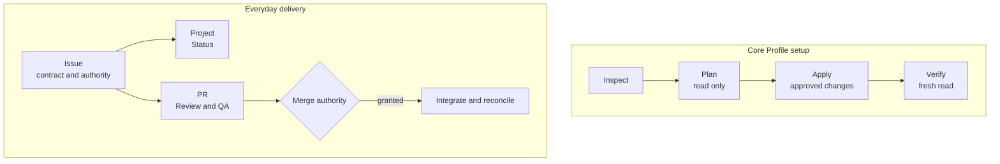

# github-workflow

[](https://github.com/monancho/github-workflow/releases) [](https://github.com/monancho/github-workflow/actions/workflows/platform-smoke.yml?query=branch%3Amain) [](docs/DISTRIBUTION.md) [](LICENSE)

**English** | [한국어](README.ko.md)

Give people and AI agents the same place to find a work item's scope, authority, and progress. `github-workflow` pairs a GitHub-native delivery contract with a local CLI that sets up its v0.1.0 Core Profile.

| Quick fit | v0.1.0 |
| --- | --- |
| **For** | Solo maintainers and small teams using a public GitHub.com repository under a personal account. |
| **Sets up** | Repository Issues, a same-owner Dedicated User Project, five Status values, two condition labels, and membership for Issues you select. |
| **Lives in** | GitHub Issues, Project, and PRs. After setup, no hosted service or running CLI is needed. |

## Before you start

- Use **Node.js 22 or 24**. Portability checks cover Ubuntu 24.04, Windows 2025, and macOS 15 on both versions.
- Use a **public personal-account GitHub.com repository** and a same-owner User Project on GitHub Free.
- Set `GH_TOKEN` or `GITHUB_TOKEN` with access to the repository and User Project for your operation. Project reads also require authentication. Keep the token out of files and commits.
- For Issue membership, choose an existing tracked Issue and check its recorded authorization. Creating or opening an Issue alone does not authorize work.

**Outside the verified v0.1.0 scope:** organization-owned or private repositories, GitHub Enterprise Server, cross-owner or shared multi-repository Projects, and other Node.js majors. Jira and Notion may be optional context for future workflows; this release does not integrate with or synchronize them. See the [requirements](https://github.com/monancho/github-workflow/blob/main/docs/REQUIREMENTS.md).

## Install

Check [GitHub Releases](https://github.com/monancho/github-workflow/releases) for publication and download the **`github-workflow-0.1.0.tgz`** asset when it is available. In the download directory, run:

```text
npm install --global ./github-workflow-0.1.0.tgz
github-workflow --version
github-workflow --help
```

This package is distributed through GitHub Releases, not the npm registry. GitHub's automatic source archives are not the installable tarball. The [distribution guide](docs/DISTRIBUTION.md) covers package contents and source builds.

## Quick start

Select one existing Issue you are authorized to reconcile. Save its number as `issues.json` in your working directory; replace `123` with the real number:

```json
[{"number":123}]
```

Replace `OWNER` and `REPO` below with their exact GitHub spelling. Keep the same `issues.json` throughout. Plan and Apply output must be saved as JSON.

### 1. Inspect

See the managed state, gaps, and conflicts without changing GitHub.

```text
github-workflow inspect --owner OWNER --repo REPO --profile v0.1.0-core-profile --issues issues.json
```

### 2. Plan and review

Save the proposed operations. Open `plan.json` before going further: `ready` lists changes, `no-change` needs none, and `blocked` needs the reported problem resolved and a new Plan.

```text
github-workflow plan --owner OWNER --repo REPO --profile v0.1.0-core-profile --issues issues.json --format json > plan.json
```

### 3. Apply the approved plan

**Apply changes GitHub.** Continue only if the operations in `plan.json` are authorized. Apply checks current managed state against the saved Plan before acting; if it changed, inspect and plan again.

```text
github-workflow apply --owner OWNER --repo REPO --profile v0.1.0-core-profile --issues issues.json --plan plan.json --format json > apply.json
```

### 4. Verify

Verify checks both saved artifacts and reads GitHub again. Treat the run as conforming only when its outcome is `verified`. That result covers the Issues in `issues.json`, not every Issue in the repository.

```text
github-workflow verify --owner OWNER --repo REPO --profile v0.1.0-core-profile --issues issues.json --plan plan.json --apply-report apply.json
```

## Work in GitHub

The CLI sets up a Project; the work itself stays in native GitHub records.



An Issue records the work contract and authorization evidence. Sub-Issues split independently tracked work; Issue Dependencies mark **actual blockers**. The Project shows `Backlog → Ready → In Progress → Review → Done`, with backward moves for rework. `blocked` and `needs-decision` are conditions, not extra Status values.

A linked PR carries the change and independent Review/QA. Execution, merge, and release authority remain separate. `Done` alone is not acceptance: close successful work as `Completed` after recording its evidence. The [workflow specification](https://github.com/monancho/github-workflow/blob/main/docs/WORKFLOW_SPEC.md) defines the full contract.

## What the CLI manages

It enables Issues, reconciles the same-owner Dedicated User Project and its five Status values, and ensures `needs-decision` and `blocked` labels. For the Issues you select, it reconciles Project membership and applicable lifecycle effects. It reuses compatible state and preserves unrelated labels, Projects, and repository settings; it will not repurpose an arbitrary Project. Existing label colors and descriptions are not rewritten to match defaults.

The CLI does not discover every tracked Issue or run the workflow for you. An unchanged, conforming target produces a no-change Plan on a repeat run.

<details>
<summary>Selection and output options</summary>

Omit `--issues` only when you want repository and Project setup without asserting Issue membership. To request an authorized initial Status other than `Backlog`, use `{"number":123,"authorizedInitialStatus":{"status":"Ready","authorizationRef":"issue-123-comment"}}` with a real recorded reference.

JSON is the default. Use `--format text` for a readable result, but keep saved Plan and Apply artifacts in JSON. Results include `schemaVersion: 1` and `resourceScope: "core-profile"`.

</details>

<details>
<summary>Recovery and exit codes</summary>

For a stale or blocked Plan, inspect and create a new Plan; do not edit the saved one. After an interrupted or partial Apply, a mutation may have an uncertain result. Read the current GitHub state, plan again, then Apply and Verify as authorized. Mutations are not automatically retried, and an incomplete Verify is not success.

The CLI does not prompt. Structured results go to stdout; an unexpected failure before a phase result also adds a generic stderr message. Results do not expose credentials or raw GitHub error bodies.

| Code | Outcome |
| --- | --- |
| `0` | `inspected`, `ready`, `no-change`, `applied`, `verified` |
| `2` | `invalid-input` |
| `3` | `blocked` |
| `4` | `unsupported` |
| `5` | `unverifiable`, `non-conforming` |
| `6` | `partial-failure`, `interrupted` |
| `7` | `failed` or unexpected failure |

</details>

## Help and reference

For non-sensitive bugs or usage questions, open a [public Issue](https://github.com/monancho/github-workflow/issues) with the CLI outcome, steps, and environment. Follow [CONTRIBUTING.md](https://github.com/monancho/github-workflow/blob/main/CONTRIBUTING.md) for changes and PRs. Send suspected vulnerabilities through the private path in [SECURITY.md](SECURITY.md), never a public Issue or Discussion.

- [Workflow specification](https://github.com/monancho/github-workflow/blob/main/docs/WORKFLOW_SPEC.md) and [requirements](https://github.com/monancho/github-workflow/blob/main/docs/REQUIREMENTS.md): behavior and support boundary.
- [Distribution guide](docs/DISTRIBUTION.md): installation, portability, and runtime details.
- [Release guide](https://github.com/monancho/github-workflow/blob/main/docs/RELEASING.md): maintainer publication steps.

Licensed under [MIT](LICENSE).
