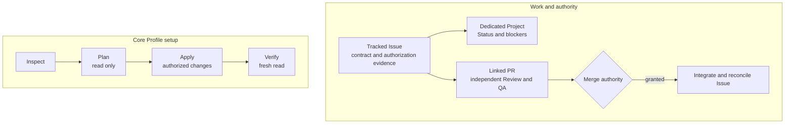

# github-workflow

[](https://github.com/monancho/github-workflow/releases)
[](https://github.com/monancho/github-workflow/actions/workflows/platform-smoke.yml?query=branch%3Amain)
[](docs/DISTRIBUTION.md)
[](LICENSE)

**English** | [한국어](README.ko.md)

**A GitHub-native work contract and setup tool for humans and AI agents.** Keep work in Issues, a dedicated Project, and pull requests so another person or agent can understand what is authorized, what is blocked, and what has been verified. The local CLI sets up and checks the v0.1.0 GitHub Core Profile; normal work continues in GitHub without a hosted service or a running `github-workflow` process.

The v0.1.0 installable package is distributed as a GitHub Release asset. Check [Releases](https://github.com/monancho/github-workflow/releases) for its publication status and the `github-workflow-0.1.0.tgz` asset.

## What it provides

- **A shared workflow contract:** tracked Issues hold the work contract and recorded authorization evidence; creating or opening an Issue alone does not authorize execution. Sub-Issues decompose independently tracked work, and Issue Dependencies represent actual blockers. A Dedicated User Project tracks `Backlog`, `Ready`, `In Progress`, `Review`, and `Done`; linked PRs carry changes, independent Review/QA, and integration evidence.
- **Core Profile provisioning:** `inspect`, `plan`, `apply`, and `verify` reconcile Issues availability, a same-owner Dedicated User Project and its Status values, the `needs-decision` and `blocked` labels, and Project membership and lifecycle effects for the tracked Issues you select.
- **Safe, observable changes:** Plan reads state without changing it. Apply checks that relevant managed state still matches the saved plan before making changes. Verify reads GitHub again. Compatible native state is reused, unrelated configuration is preserved, and a conforming repeat run plans no changes.

The CLI is a provisioning tool, not an agent runner or an ongoing synchronizer. It does not select work, approve changes, merge PRs, or grant release authority.

## How it works

The work contract lives in native GitHub records. The CLI's separate setup cycle brings selected Core Profile state into line with that contract.



## Requirements and installation

The verified v0.1.0 target is a **public GitHub.com repository owned by a personal account**, using GitHub Free capabilities and a Dedicated User Project owned by that same account. The CLI is verified on **Node.js 22 and 24**; portability checks cover Ubuntu 24.04, Windows 2025, and macOS 15 on both majors. You need a GitHub credential with access to the target repository and User Project for the operation you run. Set `GH_TOKEN` or `GITHUB_TOKEN` in your environment before using the CLI; even read-only Project inspection requires authentication. Do not put tokens in an Issue selection file or commit them.

When the v0.1.0 Release asset is available, download **`github-workflow-0.1.0.tgz`** from [GitHub Releases](https://github.com/monancho/github-workflow/releases), then run from the directory containing the downloaded file:

```text
npm install --global ./github-workflow-0.1.0.tgz
github-workflow --version
github-workflow --help
```

The package is not published to the npm registry. GitHub's automatic source archives are different from the installable npm tarball. See the [distribution guide](docs/DISTRIBUTION.md) for package contents and source-checkout instructions.

## Quick start

Choose a repository and an **existing tracked Issue** whose Project membership you are authorized to reconcile. In a working directory, create `issues.json` with its number (replace `123` with a real Issue number):

```json
[{"number":123}]
```

Use the repository owner's exact login and the repository's exact name in place of `OWNER` and `REPO`. Keep the same `issues.json` for every phase. These commands produce JSON by default; the saved Plan and Apply files must remain JSON.

```text
github-workflow inspect --owner OWNER --repo REPO --profile v0.1.0-core-profile --issues issues.json
github-workflow plan --owner OWNER --repo REPO --profile v0.1.0-core-profile --issues issues.json --format json > plan.json
```

**Read `plan.json` before continuing.** A `ready` outcome lists proposed operations; `no-change` means the selected managed state already conforms. If the result is `blocked`, resolve the reported conflict or permission problem and plan again. Running `apply` makes GitHub changes, so proceed only when those operations are authorized for your repository and Issue.

```text
github-workflow apply --owner OWNER --repo REPO --profile v0.1.0-core-profile --issues issues.json --plan plan.json --format json > apply.json
github-workflow verify --owner OWNER --repo REPO --profile v0.1.0-core-profile --issues issues.json --plan plan.json --apply-report apply.json
```

Expect `verified` from Verify before treating the selected Core Profile state as conforming. Its result covers **only the Issues in `issues.json`**, not every tracked Issue in the repository. Omit `--issues` only when you intentionally want repository and Project setup without asserting Issue membership. An authorized initial Status other than `Backlog` can be requested with `{"number":123,"authorizedInitialStatus":{"status":"Ready","authorizationRef":"issue-123-comment"}}`; record the real authorization reference first.

### What each phase does

| Phase | Result |
| --- | --- |
| `inspect` | Reads managed, missing, conflicting, and unrelated state without changing GitHub. |
| `plan` | Makes a read-only inspection and saves proposed operations with the observed-state fingerprint. |
| `apply` | Checks the saved plan and current managed state, then performs only applicable planned changes. |
| `verify` | Checks the Plan and Apply artifacts and makes a fresh GitHub read before reporting conformity. |

For a readable view, add `--format text` to a command whose output you are **not** saving as a Plan or Apply artifact. All phase results include `schemaVersion: 1` and `resourceScope: "core-profile"`.

## Working with the resulting Project

Use Issues as the durable record of objective, scope, prerequisites, decisions, and completion. The Project's Status moves through `Backlog → Ready → In Progress → Review → Done`; rework can move it backward. `blocked` and `needs-decision` describe conditions, not extra Status values. A linked PR records the proposed change, independent Review/QA, and merge decision. Execution, merge, and release authority are separate. `Done` alone does not prove acceptance: close a successful Issue as `Completed` after its evidence and reconciliation are recorded.

The CLI manages only the Core Profile objects and the selected Issues' membership and lifecycle effects. It reuses existing compatible labels and Projects, preserves unrelated labels, Projects, and repository settings, and does not repurpose an arbitrary Project. Existing label colors and descriptions are not rewritten to match defaults. It does not silently discover every tracked Issue; add missing selected Issues through an authorized reconciliation or native GitHub workflow. See the [workflow specification](https://github.com/monancho/github-workflow/blob/main/docs/WORKFLOW_SPEC.md) for the full lifecycle and authority rules.

## Failures and recovery

If Apply reports a stale or blocked plan, inspect the current state and create a **new** Plan; do not edit a saved Plan to bypass the check. After an interrupted or partially failed Apply, a mutation result may be uncertain. Inspect GitHub, plan from the observed state, and run Apply and Verify again as authorized. Mutations are not retried automatically. A failed or incomplete Verify is not success.

The CLI does not prompt. Normal structured results go to stdout; unexpected failures before a phase result also add a generic stderr message. Results avoid credentials and raw GitHub error bodies. Exit codes are:

| Code | Meaning |
| --- | --- |
| `0` | `inspected`, `ready`, `no-change`, `applied`, or `verified` |
| `2` | `invalid-input` |
| `3` | `blocked` |
| `4` | `unsupported` |
| `5` | `unverifiable` or `non-conforming` |
| `6` | `partial-failure` or `interrupted` |
| `7` | `failed` or an unexpected failure |

## Scope and further reading

Organization-owned or private repositories, GitHub Enterprise Server, cross-owner Projects, shared multi-repository Projects, and other Node.js majors are outside the verified v0.1.0 support claim. Jira and Notion may provide optional context in future workflows; v0.1.0 does not integrate with or synchronize them.

| Document | Use it for |
| --- | --- |
| [Workflow specification](https://github.com/monancho/github-workflow/blob/main/docs/WORKFLOW_SPEC.md) | Issue lifecycle, Project contract, authority, and completion. |
| [Requirements](https://github.com/monancho/github-workflow/blob/main/docs/REQUIREMENTS.md) | Normative v0.1.0 requirements and support boundary. |
| [Distribution guide](docs/DISTRIBUTION.md) | Tarball installation, platform checks, and runtime behavior. |
| [Security policy](SECURITY.md) | Supported versions and private vulnerability reporting. |
| [Contributing](https://github.com/monancho/github-workflow/blob/main/CONTRIBUTING.md) | Repository execution, PR Review/QA, and merge authority. |
| [Release guide](https://github.com/monancho/github-workflow/blob/main/docs/RELEASING.md) | Maintainer release gates and publication steps. |

## Getting help and contributing

Open a [public Issue](https://github.com/monancho/github-workflow/issues) for non-sensitive bugs or usage questions, with the relevant CLI outcome, steps, and environment. Follow [CONTRIBUTING.md](https://github.com/monancho/github-workflow/blob/main/CONTRIBUTING.md) for proposed changes and PRs. Report suspected vulnerabilities only through the private path in the [security policy](SECURITY.md), not a public Issue or Discussion.

Licensed under [MIT](LICENSE).
